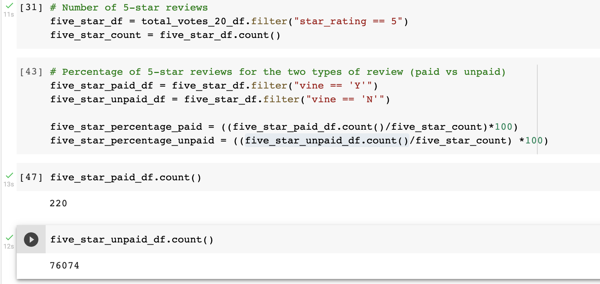
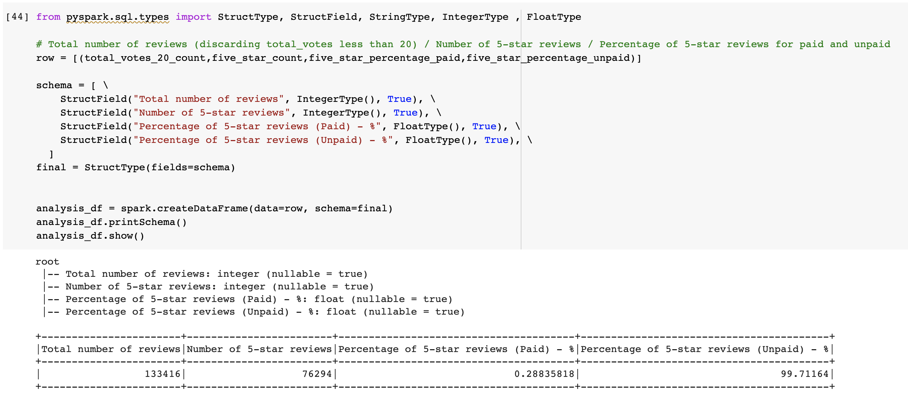

# Amazon_Vine_Analysis
Challenge 16

## Overview of the analysis of the Vine program:
The purpose of this project is analyzing Amazon reviews written by members of the paid Amazon Vine program. The Amazon Vine program is a service that allows manufacturers and publishers to receive reviews for their products. Companies like SellBy pay a small fee to Amazon and provide products to Amazon Vine members, who are then required to publish a review.

In this project, I have access to approximately 50 datasets. Each one contains reviews of a specific product, from clothing apparel to wireless products. I picked Health Personal Care (amazon_reviews_us_Health_Personal_Care_v1_00.tsv) as one of the avaiables datasets. I used PySpark to perform the ETL process to extract the dataset, transform the data, connect to an AWS RDS instance, and load the transformed data into pgAdmin. Next, I used PySpark to determine if there is any bias toward favorable reviews from Vine members in my dataset.

Bellow is the summary of the analysis to submit to the SellBy stakeholders.

## Results:

1. How many Vine reviews and non-Vine reviews were there?

If we consider the 'helpful' reviews, there were 497 paid reviews, against 120.863 unpaid reviews.

2. How many Vine reviews were 5 stars? How many non-Vine reviews were 5 stars?

If we consider all 5 star reviews that were voted more than 20 times, there were 220 paid reviews, against 76.074 unpaid reviews.

3. What percentage of Vine reviews were 5 stars? What percentage of non-Vine reviews were 5 stars?

There were only less than 1% paid reviews, against more than 99% unpaid reviews.

## Summary:

There are so little paid reviews that we can certainly state that there is no bias toward the star reviews as more than 99% of the 5 star voters were not paid for their review.

Depending on the results, would be best practice to exam the results further by calculating the statistical distribution (mean, median, and mode) of the star rating of Vine and non-Vine reviews. But as it shows so much difference, there is no need for that in this case.